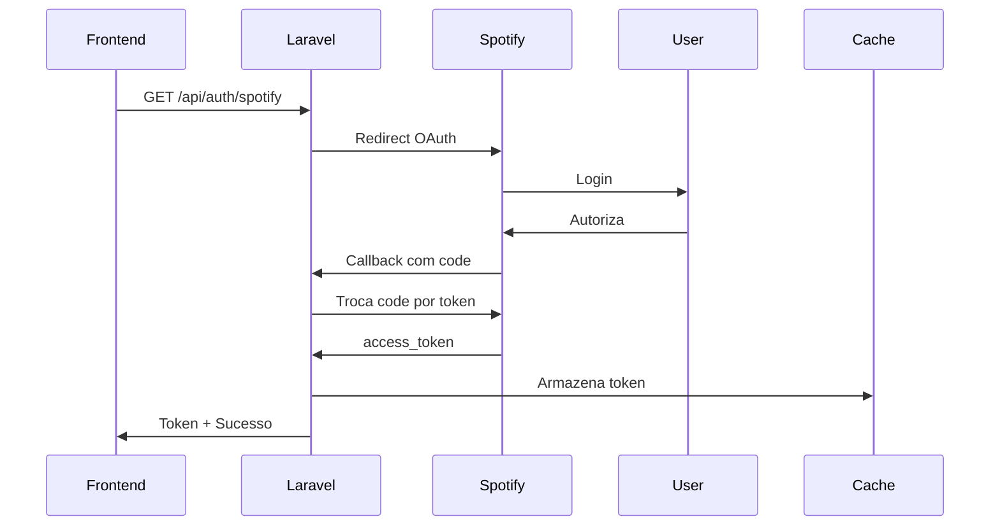

# 🚀 Setup Rápido - MusicRATE API

## ⚡ Comandos Essenciais

### 1. Configuração Inicial

```bash
# Subir containers Docker
docker-compose up -d

# Rodar migrations
docker exec musicrate_app php artisan migrate

# Limpar caches
docker exec musicrate_app php artisan config:clear
docker exec musicrate_app php artisan cache:clear
```

### 2. Registrar Middleware

Adicione no arquivo `bootstrap/app.php`:

```php
->withMiddleware(function (Middleware $middleware) {
    $middleware->alias([
        'spotify.token' => \App\Http\Middleware\EnsureSpotifyToken::class,
    ]);
})
```

### 3. Verificar Instalação

```bash
# Ver rotas disponíveis
docker exec musicrate_app php artisan route:list

# Testar conexão Spotify (após login)
curl http://localhost/api/spotify/browse/new-releases
```

---

## 📋 Checklist de Configuração

- [x] ✅ Migration `create_reviews_table` criada
- [x] ✅ Model `Review` com scopes e relacionamentos
- [x] ✅ `SpotifyService` com cache para todas as operações
- [x] ✅ `ReviewController` com CRUD completo
- [x] ✅ `SpotifyController` como proxy da API
- [x] ✅ `AuthController` melhorado com segurança CSRF
- [x] ✅ Middleware `EnsureSpotifyToken` para proteção
- [x] ✅ Form Requests para validação
- [x] ✅ Rotas API organizadas por prefixo
- [x] ✅ Config `services.spotify` adicionada

---

## 🎯 Próximos Passos

### 1. **Rodar Migration**

```bash
docker exec musicrate_app php artisan migrate
```

### 2. **Testar Autenticação**

```bash
# Abrir no browser:
http://localhost/api/auth/spotify
```

### 3. **Criar Usuário de Teste** (se necessário)

```bash
docker exec musicrate_app php artisan tinker
```

```php
User::factory()->create([
    'name' => 'Test User',
    'email' => 'test@test.com',
    'password' => bcrypt('password')
]);
```

### 4. **Testar Endpoints**

```bash
# Buscar álbuns (precisa token)
curl "http://localhost/api/spotify/search/albums?q=radiohead" \
  -H "Authorization: Bearer {seu_token_sanctum}"

# Ver reviews públicas
curl http://localhost/api/public/reviews
```

---

## 🔧 Troubleshooting

### Problema: "Token Spotify não encontrado"

**Solução:** Faça login via `/api/auth/spotify` primeiro.

### Problema: "Class SpotifyService not found"

**Solução:**

```bash
composer dump-autoload
docker exec musicrate_app composer dump-autoload
```

### Problema: Cache não funciona

**Solução:** Configure Redis no `.env`:

```env
CACHE_DRIVER=redis
REDIS_HOST=127.0.0.1
REDIS_PORT=6379
```

### Problema: Migration falha

**Solução:** Verifique conexão PostgreSQL:

```bash
docker exec musicrate_db psql -U postgres -c "\l"
```

---

## 📦 Estrutura de Arquivos Criados

```
✅ database/migrations/2025_11_30_000001_create_reviews_table.php
✅ app/Models/Review.php
✅ app/Services/SpotifyService.php
✅ app/Http/Controllers/ReviewController.php
✅ app/Http/Controllers/SpotifyController.php
✅ app/Http/Controllers/AuthController.php (melhorado)
✅ app/Http/Middleware/EnsureSpotifyToken.php
✅ app/Http/Requests/StoreReviewRequest.php
✅ app/Http/Requests/UpdateReviewRequest.php
✅ routes/api.php (criado)
✅ config/services.php (atualizado)
✅ API_DOCUMENTATION.md
✅ SETUP_RAPIDO.md
```

---

## 🎨 Fluxo de Autenticação



---

## 🗂️ Exemplo de Dados na Tabela Reviews

| id  | user_id | spotify_album_id | album_name  | artist_name | rating | review_text    |
| --- | ------- | ---------------- | ----------- | ----------- | ------ | -------------- |
| 1   | 1       | 6DEjYFk...       | Dark Side   | Pink Floyd  | 10     | Obra-prima!    |
| 2   | 2       | 2noRn2A...       | OK Computer | Radiohead   | 9      | Revolucionário |

---

## 🌐 Endpoints Principais

### Autenticação

- `GET /api/auth/spotify` - Login
- `GET /api/auth/callback` - Callback OAuth
- `GET /api/auth/token` - Ver token atual

### Reviews

- `GET /api/reviews` - Listar todas
- `POST /api/reviews` - Criar
- `PUT /api/reviews/{id}` - Atualizar
- `DELETE /api/reviews/{id}` - Deletar
- `GET /api/reviews/album/{spotify_id}` - Reviews de um álbum

### Spotify (Proxy)

- `GET /api/spotify/search/albums?q=radiohead`
- `GET /api/spotify/albums/{id}`
- `GET /api/spotify/artists/{id}`
- `GET /api/spotify/browse/new-releases`

---

## 💻 Comandos Docker Úteis

```bash
# Ver logs
docker logs musicrate_app -f

# Acessar container
docker exec -it musicrate_app sh

# Rodar artisan
docker exec musicrate_app php artisan [comando]

# Reiniciar containers
docker-compose restart

# Parar tudo
docker-compose down
```

---

## 📊 Cache Strategy

- **Albums/Artists/Tracks:** 1 hora (3600s)
- **New Releases:** 30 minutos (1800s)
- **Categories:** 2 horas (7200s)
- **Tokens Spotify:** Até expiração (geralmente 1h)

Para limpar cache específico:

```php
Cache::forget('spotify_album_6DEjYFkNZh67HP7R9PSZvv');
```

---

## ✅ Pronto para Usar!

Sua API está configurada. Agora você pode:

1. **Autenticar via Spotify**: `http://localhost/api/auth/spotify`
2. **Buscar álbuns**: Usar endpoints `/api/spotify/*`
3. **Criar reviews**: POST para `/api/reviews`
4. **Ver estatísticas**: GET `/api/reviews/stats`

---

**Dúvidas?** Consulte `API_DOCUMENTATION.md` para detalhes completos.
